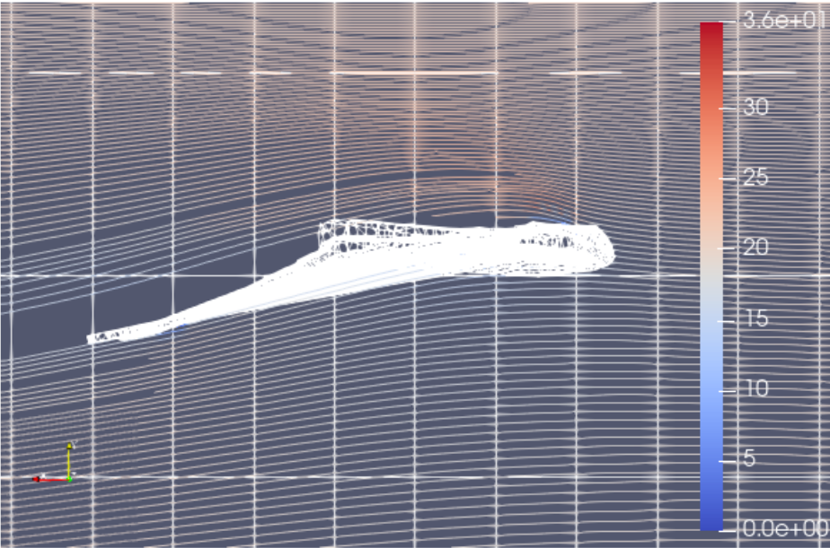
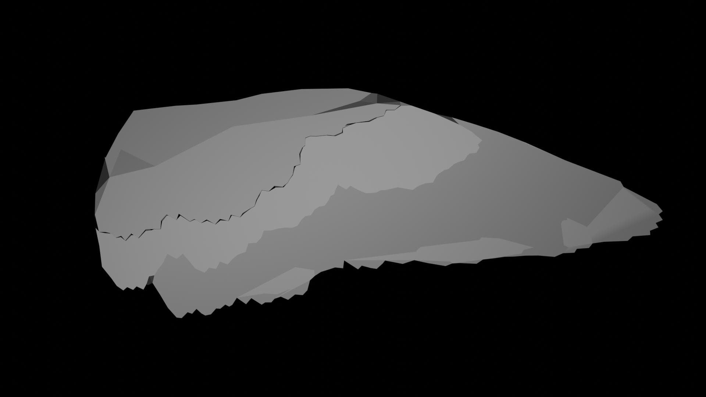
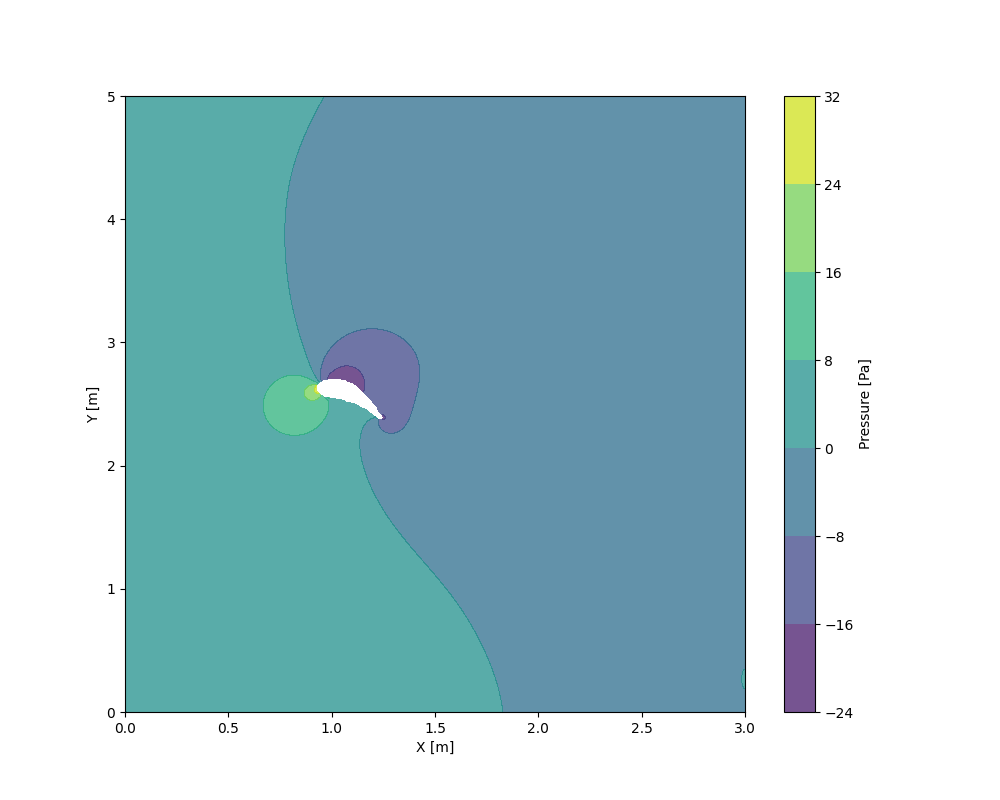

> *El vol és una de les característiques més representatives dels ocells. Les aus han patit una sèrie d’adaptacions que els permet aquesta activitat tan fonamental per la seva vida. Des d’ocells migratoris que recorren cada any milers de quilòmetres fins a ocells que volen a grans alçàries en les quals la majoria d’animals no poden ni respirar, menys encara fer una activitat exigent com volar, certament són uns organismes de gran interès. L’objectiu d’aquest treball és, precisament, entendre algunes d’aquestes adaptacions fonamentals pels ocells, així com les principals característiques del seu vol. Tot i que la mecànica darrere el vol de les aus és complex, pretenem obtenir unes nocions dels orígens d’aquesta complexitat i fer algunes simplificacions per estudiar algun cas particular.*

We present a study of the fluid dynamics of the flow of air around a bird's wings. For this, we implemented an iterative Navier-Stokes solver, coupled with the pressure Poisson equation for calculating the pressure field alongside the velocity one.

We then modeled a pair of different wings in Blender to see the differences. We also make use of OpenFOAM to create the same kind of simulation and compare ours to an already established tool.

# Images

- 
- 
- 
